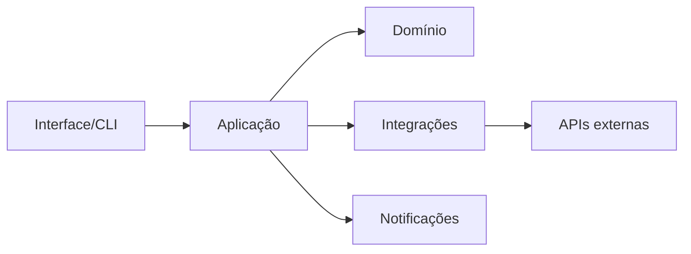

# C4 — Contêineres lógicos

```mermaid
flowchart LR
  UI[Interface/CLI] --> APP[Aplicação]
  APP --> DOM[Domínio]
  APP --> INT[Integrações]
  INT --> EXT[APIs externas]
  APP --> NOTIF[Notificações]
```
