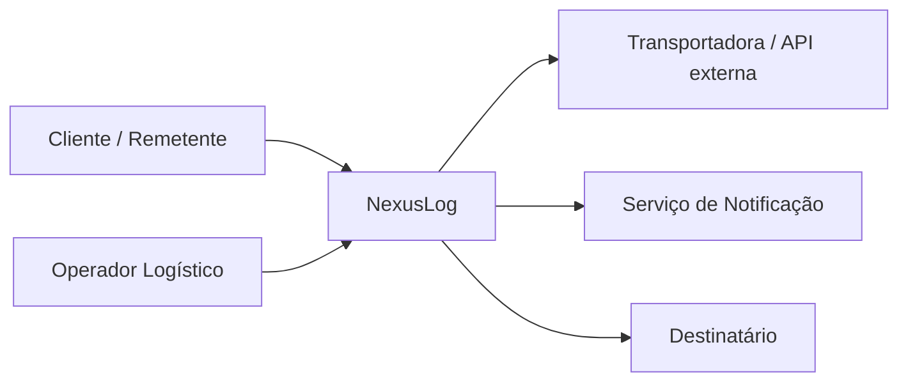

# Mapa de contexto

```mermaid
flowchart LR
    Cliente[Cliente / Remetente] --> NexusLog[NexusLog]
    Operador[Operador Logístico] --> NexusLog
    NexusLog --> Transportadora[Transportadora / API externa]
    NexusLog --> Notificacao[Serviço de Notificação]
    NexusLog --> Destinatario[Destinatário]
```

## Leitura do diagrama
O NexusLog está no centro.
Ele recebe interações humanas e conversa com sistemas externos.
Ainda não estamos detalhando classes ou componentes internos.
