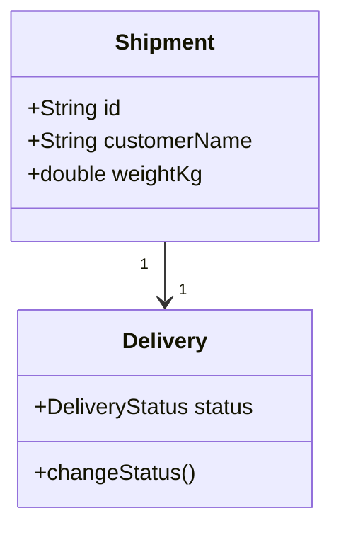

```mermaid
classDiagram
  class Shipment {
    +String id
    +String customerName
    +double weightKg
  }
  class Delivery {
    +DeliveryStatus status
    +changeStatus()
  }
  Shipment "1" --> "1" Delivery
```
