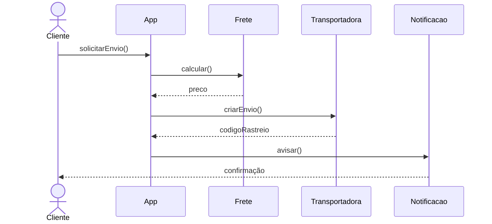

# Sequência — cenário crítico: solicitar envio

```mermaid
sequenceDiagram
  actor Cliente
  participant App
  participant Frete
  participant Transportadora
  participant Notificacao
  Cliente->>App: solicitarEnvio()
  App->>Frete: calcular()
  Frete-->>App: preco
  App->>Transportadora: criarEnvio()
  Transportadora-->>App: codigoRastreio
  App->>Notificacao: avisar()
  Notificacao-->>Cliente: confirmação
```
