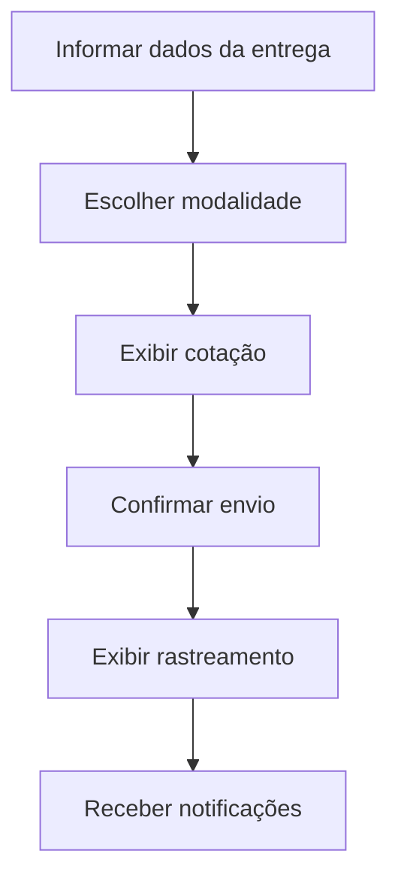

# Fluxo de interface — sem implementar frontend completo

## Rastreabilidade
- Tela/etapa B -> RF02 -> `SimpleFreightService` (cálculo de frete)
- Etapa D -> RF03 -> `ShipmentController` (API REST, Aula 08)
- Etapa E -> RF04 -> integração com transportadoras (`CarrierGateway`)
- Etapa F -> RF05 -> evento `shipment.criado` + `NotificacaoConsumer` (Aulas 11-12)

O foco da aula é mostrar que fluxo de interface, requisito e componente precisam ser coerentes.
