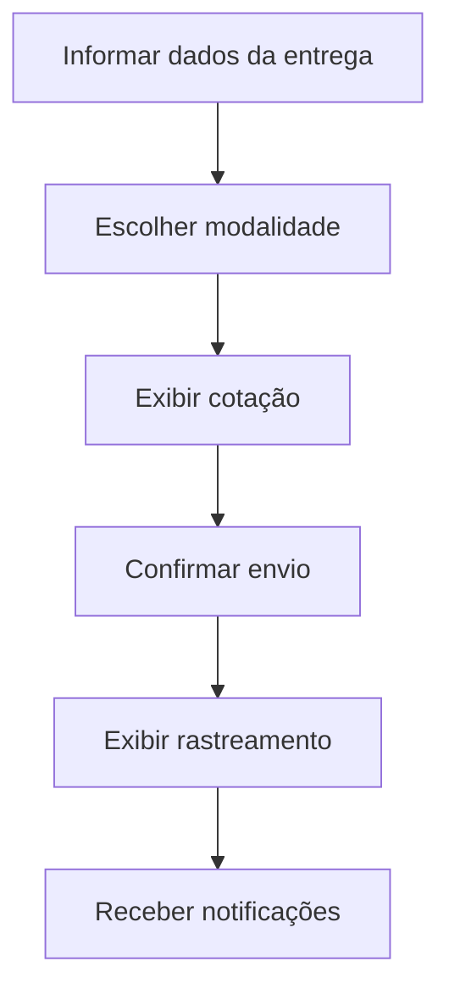

# Fluxo de interface — sem implementar frontend

## Rastreabilidade
- Tela/etapa B -> RF02 -> Strategy
- Etapa D -> RF03 -> Adapter/Facade
- Etapa E -> RF04 -> Adapter/Abstract Factory
- Etapa F -> RF05 -> Observer

O foco da aula é mostrar que fluxo de interface, requisito e componente precisam ser coerentes.
